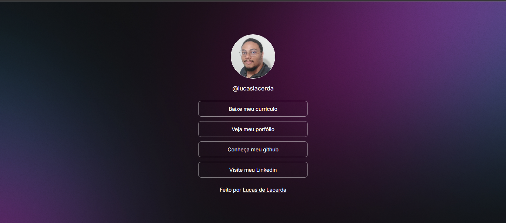

# DevLinks Project

Projeto de agregador de links para as diversas plataformas e perfis profissionais.

## Índice

  - [Prévia do Projeto](#prévia-do-projeto)
  - [Redes Sociais](#redes-sociais)
  - [Tecnologias Usadas](#tecnologias-usadas)
  - [Como usar](#installation-and-usage)
  - [Learning and Observations](#learning-and-observations)
  - [Credits](#credits)

## Prévia do Projeto

## Social Media

Connect with me on social media:
- Linkedin: [Lucas Lacerda](https://www.linkedin.com/in/lucas-lacerda-066316186/)
- GitHub: [Lucasdelacerda](https://github.com/Lucasdelacerda)

## tecnologias-usadas

- HTML
- CSS
- JavaScript

## Credits

- Author: Lucas de Lacerda
