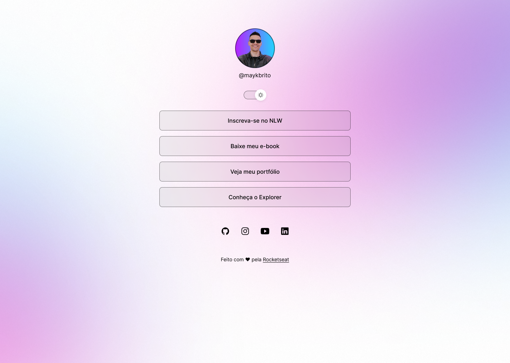

# DevLinks Project

This is a link aggregation page project developed as part of the Rocketseat course. The page includes links to access the resume, portfolio, and other professional pages, as well as links to social media. The site features a light and dark theme, a stylized button to toggle between themes, and the ability to change images when switching themes.

## Table of Contents

- [DevLinks Project](#devlinks-project)
  - [Table of Contents](#table-of-contents)
  - [Project Cover](#project-cover)
  - [Social Media](#social-media)
  - [Technologies Used](#technologies-used)
  - [Features](#features)
  - [Installation and Usage](#installation-and-usage)
  - [Learning and Observations](#learning-and-observations)
  - [Credits](#credits)

## Project Cover

## Social Media

Connect with me on social media:
- LinkedIn: [Lucas Lacerda](https://www.linkedin.com/in/lucas-lacerda-066316186/)
- GitHub: [Lucasdelacerda](https://github.com/Lucasdelacerda)

## Technologies Used

- HTML
- CSS
- JavaScript

## Features

- Links to resume, portfolio, and other professional pages.
- Smooth transition between light and dark themes.
- Stylish button to toggle between themes.
- Image changes when switching themes.
- Links to social media with external icons.

## Installation and Usage

1. Access the page through the [link](https://lucasdelacerda.github.io/DevLinks/).

## Learning and Observations

During this project, I learned how to create light and dark themes, style buttons, and dynamically manipulate images with JavaScript. Additionally, I practiced inserting external icons.

## Credits

- Developed as part of the [Rocketseat](https://rocketseat.com.br/) course.
- Author: Lucas de Lacerda
